# Framework Integral para Desarrollo de Páginas de Servicios de Alta Conversión

## Sistema de Calentadores Solares - Manual de Estándares Corporativos v2.0

---

## 📋 Tabla de Contenidos Ejecutiva

### **PARTE I: ESTRATEGIA Y FUNDAMENTOS**

1. [Marco Estratégico y Objetivos de Negocio](#1-marco-estratégico)
2. [Sistema de Identidad de Marca Digital](#2-sistema-identidad-marca)
3. [Análisis de Mercado y Competencia](#3-análisis-mercado)

### **PARTE II: PLANIFICACIÓN Y ARQUITECTURA**

4. [Arquitectura de Información y UX](#4-arquitectura-información)
5. [Estrategia SEO Avanzada](#5-estrategia-seo)
6. [Framework de Contenido y Copywriting](#6-framework-contenido)

### **PARTE III: IMPLEMENTACIÓN TÉCNICA**

7. [Especificaciones de Desarrollo Frontend](#7-especificaciones-frontend)
8. [Sistema de Componentes Reutilizables](#8-sistema-componentes)
9. [Optimización de Performance y Core Web Vitals](#9-optimización-performance)

### **PARTE IV: CONVERSIÓN Y ANÁLISIS**

10. [Optimización de Tasa de Conversión (CRO)](#10-optimización-conversión)
11. [Sistema de Métricas y KPIs](#11-sistema-métricas)
12. [Testing y Control de Calidad](#12-testing-calidad)

### **ANEXOS Y RECURSOS**

- [A. Plantillas y Boilerplates](#anexo-a-plantillas)
- [B. Checklist de Implementación](#anexo-b-checklist)
- [C. Herramientas y Recursos](#anexo-c-herramientas)
- [D. Casos de Estudio](#anexo-d-casos)

---

## PARTE I: ESTRATEGIA Y FUNDAMENTOS

## 1. Marco Estratégico y Objetivos de Negocio {#1-marco-estratégico}

### 1.1 Visión Estratégica

**Propósito del Framework**: Establecer un sistema escalable y replicable para crear páginas de servicios que generen resultados medibles en conversión, posicionamiento orgánico y retorno de inversión.

### 1.2 Objetivos SMART por Página

| Objetivo               | Métrica                              | Target       | Plazo     | Herramienta de Medición  |
| ---------------------- | ------------------------------------ | ------------ | --------- | ------------------------ |
| **Conversión**         | Tasa de conversión                   | 3-5%         | 90 días   | Google Analytics 4 + GTM |
| **SEO**                | Ranking top 3 para keyword principal | Posición 1-3 | 6 meses   | Search Console + Ahrefs  |
| **Engagement**         | Tiempo promedio en página            | >3 minutos   | 30 días   | GA4 + Hotjar             |
| **Calidad de Tráfico** | Bounce rate                          | <40%         | 60 días   | GA4                      |
| **Lead Generation**    | Leads calificados/mes                | 50+          | 90 días   | CRM + Forms              |
| **Performance**        | Core Web Vitals                      | Verde (>90)  | Inmediato | PageSpeed Insights       |

### 1.3 Customer Journey Mapping

```mermaid
graph LR
    A[Awareness] --> B[Interés]
    B --> C[Consideración]
    C --> D[Decisión]
    D --> E[Conversión]
    E --> F[Retención]
    F --> G[Advocacy]
```



**Mapeo de Contenido por Etapa**:

| Etapa             | Tipo de Contenido        | CTA Principal           | KPI Asociado     |
| ----------------- | ------------------------ | ----------------------- | ---------------- |
| **Awareness**     | SEO content, educativo   | "Conocer más"           | Impresiones, CTR |
| **Interés**       | Beneficios, casos de uso | "Ver ejemplos"          | Tiempo en página |
| **Consideración** | Comparativas, FAQs       | "Solicitar información" | Pages/session    |
| **Decisión**      | Testimonios, garantías   | "Cotizar ahora"         | Form submissions |
| **Conversión**    | Ofertas, urgencia        | "Contratar servicio"    | Conversion rate  |

### 1.4 Propuesta de Valor Diferenciada

#### Canvas de Propuesta de Valor

| Componente              | Descripción                                     | Evidencia/Prueba                    |
| ----------------------- | ----------------------------------------------- | ----------------------------------- |
| **Pain Relievers**      | Instalación en 1 día, sin complicaciones        | Testimonios, videos timelapse       |
| **Gain Creators**       | Ahorro 80% en gas, ROI en 2-3 años              | Calculadora de ahorro, casos reales |
| **Products & Services** | Instalación certificada NOM-027-ENER            | Certificados, fotos de proyectos    |
| **Customer Jobs**       | Reducir gastos, ser eco-friendly                | Estudios de caso, métricas          |
| **Pains**               | Costo inicial alto, desconfianza                | Financiamiento, garantías           |
| **Gains**               | Independencia energética, valorización inmueble | Datos de mercado, testimonios       |

---

## 2. Sistema de Identidad de Marca Digital {#2-sistema-identidad-marca}

### 2.1 Brand Guidelines Digitales

#### Sistema de Color Expandido

```css
:root {
  /* Primary Palette */
  --primary-50: #fffbeb;
  --primary-100: #fef3c7;
  --primary-200: #fde68a;
  --primary-300: #fcd34d;
  --primary-400: #fbbf24;
  --primary-500: #f59e0b; /* Main */
  --primary-600: #d97706;
  --primary-700: #b45309;
  --primary-800: #92400e;
  --primary-900: #78350f;

  /* Neutral Palette */
  --gray-50: #f9fafb;
  --gray-100: #f3f4f6;
  --gray-200: #e5e7eb;
  --gray-300: #d1d5db;
  --gray-400: #9ca3af;
  --gray-500: #6b7280;
  --gray-600: #4b5563;
  --gray-700: #374151;
  --gray-800: #1f2937;
  --gray-900: #111827;

  /* Semantic Colors */
  --success: #10b981;
  --warning: #f59e0b;
  --error: #ef4444;
  --info: #3b82f6;

  /* Gradients */
  --gradient-primary: linear-gradient(135deg, #f59e0b 0%, #d97706 100%);
  --gradient-dark: linear-gradient(135deg, #1f2937 0%, #111827 100%);
}
```

### 2.2 Sistema Tipográfico Avanzado

```css
/* Typography Scale - Modular Scale 1.25 */
:root {
  --font-xs: 0.75rem; /* 12px */
  --font-sm: 0.875rem; /* 14px */
  --font-base: 1rem; /* 16px */
  --font-lg: 1.125rem; /* 18px */
  --font-xl: 1.25rem; /* 20px */
  --font-2xl: 1.5rem; /* 24px */
  --font-3xl: 1.875rem; /* 30px */
  --font-4xl: 2.25rem; /* 36px */
  --font-5xl: 3rem; /* 48px */
  --font-6xl: 3.75rem; /* 60px */

  /* Line Heights */
  --leading-none: 1;
  --leading-tight: 1.25;
  --leading-snug: 1.375;
  --leading-normal: 1.5;
  --leading-relaxed: 1.625;
  --leading-loose: 2;

  /* Font Weights */
  --font-normal: 400;
  --font-medium: 500;
  --font-semibold: 600;
  --font-bold: 700;
  --font-extrabold: 800;
  --font-black: 900;
}

/* Font Stack Optimizado */
body {
  font-family: -apple-system, BlinkMacSystemFont, "Segoe UI", Roboto,
    "Helvetica Neue", Arial, "Noto Sans", sans-serif, "Apple Color Emoji",
    "Segoe UI Emoji", "Segoe UI Symbol", "Noto Color Emoji";
}
```

### 2.3 Grid System y Spacing

```css
/* 8-Point Grid System */
:root {
  --space-1: 0.25rem; /* 4px */
  --space-2: 0.5rem; /* 8px */
  --space-3: 0.75rem; /* 12px */
  --space-4: 1rem; /* 16px */
  --space-5: 1.25rem; /* 20px */
  --space-6: 1.5rem; /* 24px */
  --space-8: 2rem; /* 32px */
  --space-10: 2.5rem; /* 40px */
  --space-12: 3rem; /* 48px */
  --space-16: 4rem; /* 64px */
  --space-20: 5rem; /* 80px */
  --space-24: 6rem; /* 96px */
}

/* Container System */
.container {
  width: 100%;
  margin-left: auto;
  margin-right: auto;
  padding-left: var(--space-4);
  padding-right: var(--space-4);
}

@media (min-width: 640px) {
  .container {
    max-width: 640px;
  }
}

@media (min-width: 768px) {
  .container {
    max-width: 768px;
  }
}

@media (min-width: 1024px) {
  .container {
    max-width: 1024px;
  }
}

@media (min-width: 1280px) {
  .container {
    max-width: 1280px;
  }
}

@media (min-width: 1536px) {
  .container {
    max-width: 1536px;
  }
}
```

### 2.4 Iconografía y Assets Visuales

#### Sistema de Iconos

| Categoría      | Icono      | Uso                  | Formato     |
| -------------- | ---------- | -------------------- | ----------- |
| **Marca**      | ☀          | Logo, brand elements | Unicode/SVG |
| **Beneficios** | ✓ ✅ ⭐    | Listas, validación   | Unicode     |
| **Navegación** | → ▼ ☰ ✕    | Menús, acordeones    | Unicode/SVG |
| **Contacto**   | 📞 ✉ 📍    | Info de contacto     | Unicode/SVG |
| **Social**     | FB, IG, WA | Redes sociales       | SVG sprites |
| **Servicios**  | 🔧 🏠 🏢   | Tipos de servicio    | Custom SVG  |

---

## 3. Análisis de Mercado y Competencia {#3-análisis-mercado}

### 3.1 Análisis Competitivo Detallado

#### Matriz de Competidores

| Competidor       | Domain Authority | Keywords Ranking | Tráfico Mensual | Fortalezas                        | Debilidades            | Oportunidades          |
| ---------------- | ---------------- | ---------------- | --------------- | --------------------------------- | ---------------------- | ---------------------- |
| **Competitor A** | 45               | 1,234            | 15,000          | Brand recognition, content volume | Poor UX, slow site     | Better user experience |
| **Competitor B** | 38               | 876              | 8,500           | Local SEO, reviews                | Limited services       | Service expansion      |
| **Competitor C** | 42               | 1,456            | 12,000          | Technical content                 | No mobile optimization | Mobile-first approach  |

### 3.2 Keyword Research Matrix

#### Primary Keywords Analysis

| Keyword                            | Search Volume | Difficulty | CPC   | Intent        | Priority |
| ---------------------------------- | ------------- | ---------- | ----- | ------------- | -------- |
| "instalación calentadores solares" | 2,400         | 45/100     | $1.20 | Transactional | HIGH     |
| "mantenimiento calentador solar"   | 1,900         | 38/100     | $0.95 | Transactional | HIGH     |
| "precio calentador solar"          | 8,100         | 62/100     | $1.45 | Commercial    | MEDIUM   |
| "cómo funciona calentador solar"   | 3,600         | 28/100     | $0.65 | Informational | MEDIUM   |

### 3.3 SERP Feature Opportunities

| SERP Feature          | Opportunity | Implementation Strategy        | Priority |
| --------------------- | ----------- | ------------------------------ | -------- |
| **Featured Snippets** | HIGH        | FAQ schema, definition boxes   | P1       |
| **Local Pack**        | HIGH        | GMB optimization, local schema | P1       |
| **People Also Ask**   | MEDIUM      | Comprehensive FAQs             | P2       |
| **Image Pack**        | MEDIUM      | Optimized gallery images       | P2       |
| **Video Carousel**    | LOW         | YouTube integration            | P3       |

---

## PARTE II: PLANIFICACIÓN Y ARQUITECTURA

## 4. Arquitectura de Información y UX {#4-arquitectura-información}

### 4.1 Information Architecture Blueprint

```
Página de Servicio
│
├── Header Global
│   ├── Logo
│   ├── Navigation
│   │   ├── Mega Menu Services
│   │   └── Contact CTA
│   └── Mobile Menu
│
├── Breadcrumb Trail
│
├── Hero Section [Above Fold]
│   ├── H1 Headline
│   ├── Value Propositions (3)
│   ├── Primary CTA
│   └── Trust Indicators
│
├── Visual Proof Gallery
│   └── 3x3 Grid Layout
│
├── Service Detail Section
│   ├── Overview Content
│   ├── Features List
│   └── Technical Specs
│
├── Process Timeline
│   └── 4-Step Journey
│
├── Benefits Matrix
│   └── 6-8 Key Benefits
│
├── Social Proof Section
│   ├── Testimonials
│   ├── Ratings
│   └── Case Studies
│
├── FAQ Accordion
│   └── 8-12 Questions
│
├── Final CTA Section
│
└── Footer Global
```

### 4.2 User Flow Optimization


### 4.3 Wireframe Specifications

#### Desktop Layout Grid (1440px)

```
|<-------------------------- 1440px -------------------------->|
|  Margin  |<-------- Content Area (1200px) -------->|  Margin  |
|   120px  |                                          |   120px  |
|          |  Col 1  |  Col 2  |  Col 3  |  Col 4    |          |
|          |  285px  |  285px  |  285px  |  285px     |          |
|          |<-Gap20->|<-Gap20->|<-Gap20->|            |          |
```

#### Mobile Layout (375px)

```
|<------- 375px ------->|
| Padding | Content     |
|  16px   |   343px     |
|         |             |
```

### 4.4 Interaction Design Patterns

| Pattern                    | Implementation                 | User Benefit           | Technical Specs                            |
| -------------------------- | ------------------------------ | ---------------------- | ------------------------------------------ |
| **Sticky Navigation**      | Header stays visible on scroll | Easy navigation        | `position: sticky; top: 0; z-index: 1000;` |
| **Progressive Disclosure** | FAQ accordion                  | Reduces cognitive load | JS accordion with ARIA                     |
| **Lazy Loading**           | Images load on scroll          | Faster initial load    | `loading="lazy"` attribute                 |
| **Smooth Scroll**          | Anchor links animate           | Better orientation     | CSS `scroll-behavior: smooth`              |
| **Hover States**           | All interactive elements       | Clear affordances      | `:hover` with transitions                  |
| **Focus Indicators**       | Keyboard navigation            | Accessibility          | Custom focus styles                        |

---

## 5. Estrategia SEO Avanzada {#5-estrategia-seo}

### 5.1 Technical SEO Framework

#### On-Page SEO Checklist Completo

| Element              | Specification                     | Example                                                                                                 | Priority |
| -------------------- | --------------------------------- | ------------------------------------------------------------------------------------------------------- | -------- |
| **Title Tag**        | 50-60 chars, keyword front-loaded | "Instalación Calentadores Solares CDMX \| Certificados NOM-027"                                         | P1       |
| **Meta Description** | 150-160 chars, CTA included       | "Instalación profesional de calentadores solares. ✓Certificados ✓1 día ✓Garantía. Cotiza gratis ahora." | P1       |
| **H1**               | One per page, keyword included    | "Instalación Profesional de Calentadores Solares"                                                       | P1       |
| **H2-H6**            | Logical hierarchy, keywords       | Section headers with variations                                                                         | P1       |
| **URL**              | Short, descriptive, hyphenated    | `/instalacion-calentadores-solares`                                                                     | P1       |
| **Canonical**        | Self-referencing or to main       | `<link rel="canonical" href="...">`                                                                     | P1       |
| **Schema**           | Service + LocalBusiness + FAQ     | JSON-LD structured data                                                                                 | P1       |
| **Images**           | WebP, alt text, lazy loading      | Optimized with descriptive alts                                                                         | P2       |
| **Internal Links**   | 3-7 contextual links              | Varied anchor text                                                                                      | P2       |
| **Content Length**   | 1,500-2,500 words                 | Comprehensive coverage                                                                                  | P2       |

### 5.2 Advanced Schema Markup

```json
{
  "@context": "https://schema.org",
  "@graph": [
    {
      "@type": "Service",
      "@id": "https://example.com/instalacion#service",
      "name": "Instalación Profesional de Calentadores Solares",
      "description": "Servicio de instalación certificada NOM-027-ENER",
      "provider": {
        "@type": "LocalBusiness",
        "@id": "https://example.com/#business"
      },
      "areaServed": {
        "@type": "State",
        "name": "Ciudad de México"
      },
      "hasOfferCatalog": {
        "@type": "OfferCatalog",
        "name": "Servicios de Instalación",
        "itemListElement": [
          {
            "@type": "Offer",
            "name": "Instalación Residencial",
            "price": "8500",
            "priceCurrency": "MXN"
          }
        ]
      }
    },
    {
      "@type": "LocalBusiness",
      "@id": "https://example.com/#business",
      "name": "De Calentadores Solares",
      "image": "https://example.com/logo.jpg",
      "telephone": "+52-55-1234-5678",
      "address": {
        "@type": "PostalAddress",
        "streetAddress": "Calle Principal 123",
        "addressLocality": "Ciudad de México",
        "postalCode": "01234",
        "addressCountry": "MX"
      },
      "geo": {
        "@type": "GeoCoordinates",
        "latitude": 19.4326,
        "longitude": -99.1332
      },
      "openingHoursSpecification": {
        "@type": "OpeningHoursSpecification",
        "dayOfWeek": ["Monday", "Tuesday", "Wednesday", "Thursday", "Friday"],
        "opens": "09:00",
        "closes": "18:00"
      },
      "aggregateRating": {
        "@type": "AggregateRating",
        "ratingValue": "4.8",
        "reviewCount": "127"
      }
    },
    {
      "@type": "FAQPage",
      "mainEntity": [
        {
          "@type": "Question",
          "name": "¿Cuánto tiempo dura la instalación?",
          "acceptedAnswer": {
            "@type": "Answer",
            "text": "La instalación completa se realiza en un solo día, entre 4 a 8 horas."
          }
        }
      ]
    }
  ]
}
```

### 5.3 Content Optimization Matrix

| Content Type      | Word Count      | Keyword Density | LSI Keywords      | Readability Score | Update Frequency |
| ----------------- | --------------- | --------------- | ----------------- | ----------------- | ---------------- |
| **Service Pages** | 1,500-2,500     | 1-2% primary    | 15-20 variations  | 60-70 (Flesch)    | Quarterly        |
| **Landing Pages** | 800-1,200       | 2-3% primary    | 10-15 variations  | 65-75 (Flesch)    | Monthly          |
| **Blog Posts**    | 1,200-2,000     | 1-1.5% primary  | 20-30 variations  | 60-70 (Flesch)    | Bi-weekly        |
| **FAQs**          | 100-200 per Q/A | Natural         | Context-dependent | 70-80 (Flesch)    | As needed        |

---

## 6. Framework de Contenido y Copywriting {#6-framework-contenido}

### 6.1 Content Strategy Blueprint

#### Message Architecture

| Level          | Message Type          | Example                                         | Psychology Principle |
| -------------- | --------------------- | ----------------------------------------------- | -------------------- |
| **Primary**    | Core Value Prop       | "Ahorra 80% en gas con instalación certificada" | Loss Aversion        |
| **Secondary**  | Supporting Benefits   | "Instalación en 1 día, garantía 5 años"         | Risk Mitigation      |
| **Tertiary**   | Social Proof          | "Miles de familias satisfechas desde 2014"      | Social Validation    |
| **Quaternary** | Technical Credibility | "Certificados NOM-027-ENER, avalados FIDE"      | Authority            |

### 6.2 Copywriting Formulas

#### AIDA Framework Application

| Stage         | Content Element | Example Copy                                                   | Placement        |
| ------------- | --------------- | -------------------------------------------------------------- | ---------------- |
| **Attention** | Headline        | "Reduce 80% Tu Recibo de Gas Este Mes"                         | H1 Hero          |
| **Interest**  | Subheadline     | "Instalación profesional en 1 día con garantía extendida"      | Hero subtitle    |
| **Desire**    | Benefits        | "Recupera tu inversión en 24 meses mientras cuidas el planeta" | Benefits section |
| **Action**    | CTA             | "Solicita Tu Cotización Gratuita Ahora"                        | Multiple CTAs    |

#### PAS Formula (Problem-Agitate-Solution)

```
PROBLEM: "¿Cansado de pagar recibos de gas cada vez más altos?"
AGITATE: "Cada mes que pasa sin energía solar, pierdes dinero que podrías estar ahorrando."
SOLUTION: "Nuestros calentadores solares certificados reducen tu gasto hasta 80% desde el primer mes."
```

### 6.3 Content Templates

#### Hero Section Copy Template

```
[HEADLINE - Benefit + Keyword]
"[Action Verb] [Percentage/Number] [Benefit] con [Service + Differentiator]"

[SUBHEADLINE - Expansion of benefit]
"[Specific Feature] que [Specific Result] para [Target Audience]"

[VALUE PROPS - 3 bullets]
✓ [Feature] + [Specific Benefit]
✓ [Certification/Credential] + [Trust Element]
✓ [Guarantee/Promise] + [Risk Reversal]

[CTA - Action-oriented]
"[Verb] + [Offer] + [Urgency/Incentive]"
```

### 6.4 SEO Content Optimization

#### Keyword Integration Strategy

| Section              | Primary KW      | Secondary KWs    | LSI Terms      | Density |
| -------------------- | --------------- | ---------------- | -------------- | ------- |
| **Title/H1**         | 1x exact        | -                | -              | 100%    |
| **First Paragraph**  | 1x exact        | 1-2 variations   | 2-3 related    | 3-4%    |
| **Body Content**     | 2-3x natural    | 4-6 variations   | 10-15 related  | 1-2%    |
| **Subheadings**      | 1-2x partial    | 2-3 variations   | Natural        | 2-3%    |
| **Meta Description** | 1x exact        | 1 variation      | 1-2 related    | 2-3%    |
| **Image Alts**       | 1x per 3 images | Variations       | Descriptive    | Natural |
| **FAQs**             | Natural use     | Questions format | Conversational | <1%     |

---

## PARTE III: IMPLEMENTACIÓN TÉCNICA

## 7. Especificaciones de Desarrollo Frontend {#7-especificaciones-frontend}

### 7.1 Modern CSS Architecture

#### CSS Custom Properties System

```css
/* Design Tokens */
:root {
  /* Colors */
  --color-primary: hsl(37, 92%, 50%);
  --color-primary-dark: hsl(27, 90%, 43%);
  --color-primary-light: hsl(48, 95%, 68%);

  /* Spacing Scale */
  --spacing-base: 1rem;
  --spacing-scale: 1.25;
  --spacing-xs: calc(
    var(--spacing-base) / var(--spacing-scale) / var(--spacing-scale)
  );
  --spacing-sm: calc(var(--spacing-base) / var(--spacing-scale));
  --spacing-md: var(--spacing-base);
  --spacing-lg: calc(var(--spacing-base) * var(--spacing-scale));
  --spacing-xl: calc(
    var(--spacing-base) * var(--spacing-scale) * var(--spacing-scale)
  );

  /* Typography Scale */
  --font-size-base: clamp(1rem, 2vw, 1.125rem);
  --font-scale: 1.25;
  --font-size-sm: calc(var(--font-size-base) / var(--font-scale));
  --font-size-md: var(--font-size-base);
  --font-size-lg: calc(var(--font-size-base) * var(--font-scale));
  --font-size-xl: calc(
    var(--font-size-base) * var(--font-scale) * var(--font-scale)
  );

  /* Animations */
  --transition-base: 250ms ease;
  --transition-slow: 500ms ease-out;
  --transition-fast: 150ms ease-in;

  /* Shadows */
  --shadow-sm: 0 1px 3px rgba(0, 0, 0, 0.12);
  --shadow-md: 0 4px 6px rgba(0, 0, 0, 0.15);
  --shadow-lg: 0 10px 20px rgba(0, 0, 0, 0.15);
  --shadow-xl: 0 20px 40px rgba(0, 0, 0, 0.2);

  /* Borders */
  --border-radius-sm: 0.25rem;
  --border-radius-md: 0.5rem;
  --border-radius-lg: 1rem;
  --border-radius-xl: 1.5rem;

  /* Z-index Scale */
  --z-base: 0;
  --z-dropdown: 100;
  --z-sticky: 200;
  --z-overlay: 300;
  --z-modal: 400;
  --z-toast: 500;
}

/* Dark Mode Support */
@media (prefers-color-scheme: dark) {
  :root {
    --color-bg: hsl(220, 20%, 10%);
    --color-text: hsl(220, 20%, 85%);
  }
}

/* Responsive Typography */
@media (min-width: 768px) {
  :root {
    --font-size-base: 1.125rem;
  }
}
```

### 7.2 Component-Based CSS Architecture

```css
/* BEM Methodology with Utilities */

/* Component */
.service-card {
  /* Layout */
  display: flex;
  flex-direction: column;
  gap: var(--spacing-md);

  /* Box Model */
  padding: var(--spacing-lg);
  margin-bottom: var(--spacing-xl);

  /* Visual */
  background: var(--color-white);
  border-radius: var(--border-radius-lg);
  box-shadow: var(--shadow-md);

  /* Animation */
  transition: transform var(--transition-base), box-shadow var(--transition-base);
}

/* Element */
.service-card__header {
  display: flex;
  align-items: center;
  justify-content: space-between;
}

.service-card__title {
  font-size: var(--font-size-lg);
  font-weight: var(--font-bold);
  color: var(--color-primary);
}

.service-card__content {
  line-height: var(--leading-relaxed);
  color: var(--color-gray-600);
}

/* Modifier */
.service-card--featured {
  border: 2px solid var(--color-primary);
}

/* State */
.service-card:hover {
  transform: translateY(-4px);
  box-shadow: var(--shadow-lg);
}

/* Responsive */
@container (min-width: 768px) {
  .service-card {
    flex-direction: row;
  }
}
```

### 7.3 JavaScript Architecture

```javascript
/**
 * Service Page Controller
 * Handles all interactions for service pages
 */

class ServicePageController {
  constructor() {
    this.init();
    this.setupEventListeners();
    this.initLazyLoading();
    this.initAnimations();
  }

  init() {
    // Initialize components
    this.faqAccordion = new FAQAccordion(".faq-container");
    this.gallery = new ImageGallery(".gallery-grid");
    this.forms = new FormHandler("form[data-contact]");
    this.analytics = new AnalyticsTracker();
  }

  setupEventListeners() {
    // Smooth scroll for anchor links
    document.querySelectorAll('a[href^="#"]').forEach((anchor) => {
      anchor.addEventListener("click", this.smoothScroll.bind(this));
    });

    // CTA tracking
    document.querySelectorAll(".cta-button").forEach((cta) => {
      cta.addEventListener("click", this.trackCTA.bind(this));
    });

    // Intersection Observer for animations
    this.setupIntersectionObserver();
  }

  smoothScroll(e) {
    e.preventDefault();
    const targetId = e.currentTarget.getAttribute("href");
    const targetElement = document.querySelector(targetId);

    if (targetElement) {
      const offsetTop = targetElement.offsetTop - 100; // Account for sticky header
      window.scrollTo({
        top: offsetTop,
        behavior: "smooth",
      });
    }
  }

  trackCTA(e) {
    const ctaText = e.currentTarget.innerText;
    const ctaLocation = e.currentTarget.dataset.location;

    // Send to Google Analytics
    gtag("event", "cta_click", {
      cta_text: ctaText,
      cta_location: ctaLocation,
      page_url: window.location.href,
    });
  }

  setupIntersectionObserver() {
    const observerOptions = {
      threshold: 0.1,
      rootMargin: "0px 0px -100px 0px",
    };

    const observer = new IntersectionObserver((entries) => {
      entries.forEach((entry) => {
        if (entry.isIntersecting) {
          entry.target.classList.add("animate-in");
          observer.unobserve(entry.target);
        }
      });
    }, observerOptions);

    // Observe all animatable elements
    document.querySelectorAll("[data-animate]").forEach((el) => {
      observer.observe(el);
    });
  }

  initLazyLoading() {
    if ("loading" in HTMLImageElement.prototype) {
      // Native lazy loading supported
      const images = document.querySelectorAll('img[loading="lazy"]');
      images.forEach((img) => {
        img.src = img.dataset.src || img.src;
      });
    } else {
      // Fallback to Intersection Observer
      this.lazyLoadImages();
    }
  }

  lazyLoadImages() {
    const imageObserver = new IntersectionObserver((entries) => {
      entries.forEach((entry) => {
        if (entry.isIntersecting) {
          const img = entry.target;
          img.src = img.dataset.src;
          img.classList.add("loaded");
          imageObserver.unobserve(img);
        }
      });
    });

    document.querySelectorAll("img[data-src]").forEach((img) => {
      imageObserver.observe(img);
    });
  }

  initAnimations() {
    // GSAP animations if available
    if (typeof gsap !== "undefined") {
      gsap.from(".hero-content", {
        duration: 1,
        y: 50,
        opacity: 0,
        ease: "power3.out",
      });

      gsap.from(".gallery-item", {
        duration: 0.8,
        scale: 0.8,
        opacity: 0,
        stagger: 0.1,
        ease: "power2.out",
        scrollTrigger: ".gallery",
      });
    }
  }
}

// Initialize when DOM is ready
document.addEventListener("DOMContentLoaded", () => {
  new ServicePageController();
});
```

### 7.4 Performance-First HTML Structure

```html
<!DOCTYPE html>
<html lang="es" class="no-js">
  <head>
    <meta charset="UTF-8" />
    <meta name="viewport" content="width=device-width, initial-scale=1.0" />
    <meta http-equiv="X-UA-Compatible" content="IE=edge" />

    <!-- Preconnect to external domains -->
    <link rel="preconnect" href="https://fonts.googleapis.com" />
    <link rel="preconnect" href="https://www.googletagmanager.com" />

    <!-- DNS Prefetch for resources -->
    <link rel="dns-prefetch" href="//www.google-analytics.com" />

    <!-- Preload critical resources -->
    <link rel="preload" href="/css/critical.css" as="style" />
    <link
      rel="preload"
      href="/fonts/main-font.woff2"
      as="font"
      type="font/woff2"
      crossorigin
    />

    <!-- Critical CSS inline -->
    <style>
      /* Inline critical path CSS here */
      :root {
        --primary: #f59e0b;
      }
      body {
        margin: 0;
        font-family: system-ui;
      }
    </style>

    <!-- SEO Meta Tags -->
    <title>
      Instalación Calentadores Solares | Certificados NOM-027 | De Calentadores
      Solares
    </title>
    <meta
      name="description"
      content="Instalación profesional de calentadores solares en 1 día. ✓Certificados ✓Garantía 5 años ✓Cotización gratis. Ahorra 80% en gas."
    />

    <!-- Open Graph -->
    <meta
      property="og:title"
      content="Instalación Profesional Calentadores Solares"
    />
    <meta
      property="og:description"
      content="Instalación certificada en 1 día. Ahorra 80% en gas."
    />
    <meta property="og:image" content="https://example.com/og-image.jpg" />
    <meta property="og:url" content="https://example.com/instalacion" />
    <meta property="og:type" content="website" />

    <!-- Twitter Card -->
    <meta name="twitter:card" content="summary_large_image" />
    <meta
      name="twitter:title"
      content="Instalación Calentadores Solares Certificada"
    />
    <meta
      name="twitter:description"
      content="Instalación profesional en 1 día con garantía."
    />
    <meta
      name="twitter:image"
      content="https://example.com/twitter-image.jpg"
    />

    <!-- Canonical -->
    <link rel="canonical" href="https://example.com/instalacion" />

    <!-- Favicon -->
    <link rel="icon" type="image/svg+xml" href="/favicon.svg" />
    <link rel="icon" type="image/png" href="/favicon.png" />

    <!-- Non-critical CSS -->
    <link
      rel="stylesheet"
      href="/css/main.css"
      media="print"
      onload="this.media='all'"
    />
    <noscript><link rel="stylesheet" href="/css/main.css" /></noscript>

    <!-- Schema.org JSON-LD -->
    <script type="application/ld+json">
      {
        /* Schema here */
      }
    </script>
  </head>
  <body>
    <!-- Skip to content for accessibility -->
    <a href="#main" class="skip-link">Saltar al contenido principal</a>

    <!-- Content here -->

    <!-- Deferred JavaScript -->
    <script src="/js/main.js" defer></script>

    <!-- Google Analytics (async) -->
    <script
      async
      src="https://www.googletagmanager.com/gtag/js?id=GA_MEASUREMENT_ID"
    ></script>
  </body>
</html>
```

---

## 8. Sistema de Componentes Reutilizables {#8-sistema-componentes}

### 8.1 Component Library

#### Button Component System

```css
/* Base Button */
.btn {
  /* Reset */
  appearance: none;
  border: none;
  background: none;
  font: inherit;
  cursor: pointer;

  /* Base Styles */
  display: inline-flex;
  align-items: center;
  justify-content: center;
  gap: var(--spacing-xs);
  padding: var(--spacing-sm) var(--spacing-lg);
  font-weight: var(--font-semibold);
  text-decoration: none;
  border-radius: var(--border-radius-md);
  transition: all var(--transition-base);

  /* States */
  &:hover {
    transform: translateY(-2px);
  }
  &:active {
    transform: translateY(0);
  }
  &:focus-visible {
    outline: 2px solid var(--color-primary);
    outline-offset: 2px;
  }
  &:disabled {
    opacity: 0.5;
    cursor: not-allowed;
  }
}

/* Variants */
.btn--primary {
  background: var(--color-primary);
  color: var(--color-white);
  box-shadow: var(--shadow-md);

  &:hover {
    background: var(--color-primary-dark);
    box-shadow: var(--shadow-lg);
  }
}

.btn--secondary {
  background: var(--color-white);
  color: var(--color-primary);
  border: 2px solid var(--color-primary);

  &:hover {
    background: var(--color-primary-light);
  }
}

/* Sizes */
.btn--sm {
  padding: var(--spacing-xs) var(--spacing-md);
  font-size: var(--font-size-sm);
}
.btn--md {
  padding: var(--spacing-sm) var(--spacing-lg);
  font-size: var(--font-size-md);
}
.btn--lg {
  padding: var(--spacing-md) var(--spacing-xl);
  font-size: var(--font-size-lg);
}

/* Special */
.btn--full {
  width: 100%;
}
.btn--icon {
  padding: var(--spacing-sm);
}
```

#### Card Component System

```css
/* Card Container */
.card {
  --card-padding: var(--spacing-lg);
  --card-gap: var(--spacing-md);

  position: relative;
  display: flex;
  flex-direction: column;
  gap: var(--card-gap);
  padding: var(--card-padding);
  background: var(--color-white);
  border-radius: var(--border-radius-lg);
  box-shadow: var(--shadow-sm);
  transition: all var(--transition-base);
}

/* Card Elements */
.card__header {
  display: flex;
  align-items: center;
  justify-content: space-between;
  padding-bottom: var(--spacing-md);
  border-bottom: 1px solid var(--color-gray-200);
}

.card__title {
  font-size: var(--font-size-lg);
  font-weight: var(--font-bold);
  color: var(--color-dark);
}

.card__subtitle {
  font-size: var(--font-size-sm);
  color: var(--color-gray-500);
  margin-top: var(--spacing-xs);
}

.card__body {
  flex: 1;
  color: var(--color-gray-600);
  line-height: var(--leading-relaxed);
}

.card__footer {
  display: flex;
  align-items: center;
  justify-content: space-between;
  padding-top: var(--spacing-md);
  border-top: 1px solid var(--color-gray-200);
}

/* Card Variants */
.card--elevated {
  box-shadow: var(--shadow-md);

  &:hover {
    box-shadow: var(--shadow-lg);
    transform: translateY(-4px);
  }
}

.card--bordered {
  box-shadow: none;
  border: 2px solid var(--color-gray-200);

  &:hover {
    border-color: var(--color-primary);
  }
}

.card--featured {
  border: 2px solid var(--color-primary);

  &::before {
    content: "DESTACADO";
    position: absolute;
    top: 0;
    right: var(--spacing-md);
    transform: translateY(-50%);
    padding: var(--spacing-xs) var(--spacing-sm);
    background: var(--color-primary);
    color: var(--color-white);
    font-size: var(--font-size-xs);
    font-weight: var(--font-bold);
    border-radius: var(--border-radius-sm);
  }
}
```

### 8.2 Form System

```html
<!-- Form Component Structure -->
<form class="form" data-validate>
  <div class="form__group">
    <label class="form__label" for="name">
      Nombre Completo
      <span class="form__required">*</span>
    </label>
    <input
      type="text"
      id="name"
      name="name"
      class="form__input"
      required
      aria-required="true"
      aria-describedby="name-error"
    />
    <span class="form__error" id="name-error" role="alert"></span>
    <span class="form__help">Ingresa tu nombre completo</span>
  </div>

  <div class="form__group">
    <label class="form__label" for="phone">
      Teléfono
      <span class="form__required">*</span>
    </label>
    <div class="form__input-group">
      <span class="form__addon">+52</span>
      <input
        type="tel"
        id="phone"
        name="phone"
        class="form__input"
        pattern="[0-9]{10}"
        required
      />
    </div>
  </div>

  <div class="form__group">
    <label class="form__label" for="service"> Servicio de Interés </label>
    <select class="form__select" id="service" name="service">
      <option value="">Selecciona un servicio</option>
      <option value="instalacion">Instalación</option>
      <option value="mantenimiento">Mantenimiento</option>
      <option value="reparacion">Reparación</option>
    </select>
  </div>

  <div class="form__actions">
    <button type="submit" class="btn btn--primary btn--lg">
      Enviar Cotización
    </button>
  </div>
</form>
```

```css
/* Form Styles */
.form {
  --form-spacing: var(--spacing-md);

  display: flex;
  flex-direction: column;
  gap: var(--form-spacing);
}

.form__group {
  display: flex;
  flex-direction: column;
  gap: var(--spacing-xs);
}

.form__label {
  font-weight: var(--font-medium);
  color: var(--color-dark);
}

.form__required {
  color: var(--color-error);
  margin-left: var(--spacing-xs);
}

.form__input,
.form__select,
.form__textarea {
  padding: var(--spacing-sm) var(--spacing-md);
  background: var(--color-white);
  border: 2px solid var(--color-gray-300);
  border-radius: var(--border-radius-md);
  font: inherit;
  transition: all var(--transition-base);

  &:hover {
    border-color: var(--color-gray-400);
  }

  &:focus {
    outline: none;
    border-color: var(--color-primary);
    box-shadow: 0 0 0 3px rgba(245, 158, 11, 0.1);
  }

  &[aria-invalid="true"] {
    border-color: var(--color-error);
  }
}

.form__input-group {
  display: flex;

  .form__addon {
    display: flex;
    align-items: center;
    padding: 0 var(--spacing-md);
    background: var(--color-gray-100);
    border: 2px solid var(--color-gray-300);
    border-right: none;
    border-radius: var(--border-radius-md) 0 0 var(--border-radius-md);
  }

  .form__input {
    border-radius: 0 var(--border-radius-md) var(--border-radius-md) 0;
  }
}

.form__error {
  color: var(--color-error);
  font-size: var(--font-size-sm);
  min-height: var(--font-size-sm);

  &:not(:empty) {
    margin-top: var(--spacing-xs);
  }
}

.form__help {
  color: var(--color-gray-500);
  font-size: var(--font-size-sm);
}

.form__actions {
  display: flex;
  gap: var(--spacing-md);
  margin-top: var(--spacing-md);
}
```

---

## 9. Optimización de Performance y Core Web Vitals {#9-optimización-performance}

### 9.1 Performance Budget

| Metric                     | Target | Maximum | Tool            |
| -------------------------- | ------ | ------- | --------------- |
| **Page Weight**            | <1MB   | 1.5MB   | Chrome DevTools |
| **Requests**               | <50    | 75      | WebPageTest     |
| **Time to Interactive**    | <3.5s  | 5s      | Lighthouse      |
| **First Contentful Paint** | <1.5s  | 2.5s    | Lighthouse      |
| **Speed Index**            | <3s    | 4.5s    | Lighthouse      |

### 9.2 Core Web Vitals Optimization

#### LCP (Largest Contentful Paint) < 2.5s

```html
<!-- Preload hero image -->
<link rel="preload" as="image" href="hero-image.webp" type="image/webp" />

<!-- Optimize hero section -->
<section class="hero">
  <picture>
    <source
      srcset="hero-mobile.webp"
      media="(max-width: 768px)"
      type="image/webp"
    />
    <source
      srcset="hero-desktop.webp"
      media="(min-width: 769px)"
      type="image/webp"
    />
    
  </picture>
</section>
```

#### FID (First Input Delay) < 100ms

```javascript
// Break up long tasks
function processLargeDataset(items) {
  const chunkSize = 100;
  let index = 0;

  function processChunk() {
    const chunk = items.slice(index, index + chunkSize);
    chunk.forEach(processItem);
    index += chunkSize;

    if (index < items.length) {
      // Yield to main thread
      requestIdleCallback(processChunk);
    }
  }

  processChunk();
}

// Use passive event listeners
document.addEventListener("scroll", handleScroll, { passive: true });
```

#### CLS (Cumulative Layout Shift) < 0.1

```css
/* Reserve space for dynamic content */
.image-container {
  aspect-ratio: 16 / 9;
  background: var(--color-gray-100);
}

.ad-container {
  min-height: 250px;
}

/* Font loading optimization */
@font-face {
  font-family: "CustomFont";
  src: url("font.woff2") format("woff2");
  font-display: swap; /* Prevents layout shift */
}
```

### 9.3 Resource Loading Strategy

```html
<!-- Resource Hints -->
<link rel="dns-prefetch" href="//cdn.example.com" />
<link rel="preconnect" href="https://fonts.googleapis.com" />
<link rel="prefetch" href="/next-page.html" />
<link rel="prerender" href="/most-likely-next-page.html" />

<!-- Critical CSS Inline -->
<style>
  /* Critical above-the-fold styles */
  body {
    margin: 0;
    font-family: system-ui;
  }
  .hero {
    height: 100vh;
  }
</style>

<!-- Non-critical CSS -->
<link
  rel="preload"
  href="/css/main.css"
  as="style"
  onload="this.onload=null;this.rel='stylesheet'"
/>
<noscript><link rel="stylesheet" href="/css/main.css" /></noscript>

<!-- JavaScript Loading Strategy -->
<script src="/js/critical.js" async></script>
<script src="/js/analytics.js" defer></script>
<script src="/js/enhancement.js" type="module"></script>
```

### 9.4 Image Optimization Pipeline

```bash
# Image optimization script
#!/bin/bash

# Convert to WebP
for img in *.{jpg,jpeg,png}; do
  cwebp -q 80 "$img" -o "${img%.*}.webp"
done

# Generate responsive images
for img in *.jpg; do
  # Mobile
  convert "$img" -resize 640x -quality 85 "${img%.*}-640w.jpg"
  # Tablet
  convert "$img" -resize 1024x -quality 85 "${img%.*}-1024w.jpg"
  # Desktop
  convert "$img" -resize 1920x -quality 85 "${img%.*}-1920w.jpg"
done
```

```html
<!-- Responsive images with WebP -->
<picture>
  <source
    type="image/webp"
    srcset="
      image-640w.webp   640w,
      image-1024w.webp 1024w,
      image-1920w.webp 1920w
    "
    sizes="(max-width: 640px) 100vw,
           (max-width: 1024px) 50vw,
           33vw"
  />
  <source
    type="image/jpeg"
    srcset="image-640w.jpg 640w, image-1024w.jpg 1024w, image-1920w.jpg 1920w"
    sizes="(max-width: 640px) 100vw,
           (max-width: 1024px) 50vw,
           33vw"
  />
  
</picture>
```

---

## PARTE IV: CONVERSIÓN Y ANÁLISIS

## 10. Optimización de Tasa de Conversión (CRO) {#10-optimización-conversión}

### 10.1 Conversion Funnel Optimization

| Stage          | Metric          | Benchmark | Target    | Optimization Tactics             |
| -------------- | --------------- | --------- | --------- | -------------------------------- |
| **Awareness**  | Impressions     | -         | 10,000/mo | SEO, content marketing           |
| **Interest**   | CTR             | 2%        | 3-4%      | Meta descriptions, rich snippets |
| **Engagement** | Time on Page    | 2min      | 3-4min    | Content quality, UX              |
| **Action**     | Form Views      | 20%       | 30%       | CTA placement, messaging         |
| **Conversion** | Form Completion | 10%       | 15-20%    | Form optimization, trust signals |

### 10.2 A/B Testing Framework

#### Test Prioritization Matrix

| Element           | Impact | Effort | Priority | Test Type    |
| ----------------- | ------ | ------ | -------- | ------------ |
| **Headline**      | HIGH   | LOW    | P1       | A/B          |
| **CTA Button**    | HIGH   | LOW    | P1       | Multivariate |
| **Hero Image**    | MEDIUM | MEDIUM | P2       | A/B          |
| **Form Length**   | HIGH   | MEDIUM | P1       | A/B          |
| **Social Proof**  | MEDIUM | LOW    | P2       | A/B          |
| **Price Display** | HIGH   | LOW    | P1       | A/B          |

#### Sample A/B Test Configuration

```javascript
// Google Optimize implementation
function runABTest() {
  // Variant A: Original
  const variantA = {
    headline: "Instalación Profesional de Calentadores Solares",
    cta: "Solicitar Cotización",
    color: "#f59e0b",
  };

  // Variant B: Urgency
  const variantB = {
    headline: "Ahorra 80% en Gas desde Este Mes",
    cta: "Cotizar Ahora - Sin Costo",
    color: "#d97706",
  };

  // Random assignment
  const variant = Math.random() > 0.5 ? variantB : variantA;

  // Apply variant
  document.querySelector("h1").textContent = variant.headline;
  document.querySelector(".cta-button").textContent = variant.cta;
  document.querySelector(".cta-button").style.background = variant.color;

  // Track variant
  gtag("event", "experiment_impression", {
    experiment_id: "hero_optimization_001",
    variant_id: variant === variantA ? "control" : "variant_b",
  });
}
```

### 10.3 Trust Signals Implementation

| Trust Element       | Implementation                | Impact on Conversion |
| ------------------- | ----------------------------- | -------------------- |
| **Certifications**  | NOM-027-ENER badges           | +15% trust           |
| **Testimonials**    | Video + text with photos      | +12% credibility     |
| **Guarantee Badge** | "5 años garantía" seal        | +18% confidence      |
| **Security Icons**  | SSL, payment methods          | +10% trust           |
| **Social Proof**    | "2,847 instalaciones" counter | +8% authority        |
| **Response Time**   | "Respuesta en 24hrs"          | +7% urgency          |

---

## 11. Sistema de Métricas y KPIs {#11-sistema-métricas}

### 11.1 KPI Dashboard Structure

#### Primary KPIs (Business Impact)

| KPI                         | Formula                                 | Target      | Frequency |
| --------------------------- | --------------------------------------- | ----------- | --------- |
| **Conversion Rate**         | (Conversions / Visitors) × 100          | 3-5%        | Daily     |
| **Cost per Lead**           | Ad Spend / Leads Generated              | <$50 MXN    | Weekly    |
| **Lead Quality Score**      | (SQLs / Total Leads) × 100              | >40%        | Weekly    |
| **Revenue per Visitor**     | Revenue / Unique Visitors               | $150 MXN    | Monthly   |
| **Customer Lifetime Value** | Avg Purchase × Purchase Freq × Lifespan | $25,000 MXN | Quarterly |

#### Secondary KPIs (Performance Indicators)

| KPI                   | Formula                            | Target | Frequency |
| --------------------- | ---------------------------------- | ------ | --------- |
| **Page Load Time**    | Time to Interactive                | <3s    | Daily     |
| **Bounce Rate**       | Single Page Sessions / Total       | <40%   | Daily     |
| **Pages per Session** | Page Views / Sessions              | >3     | Weekly    |
| **Form Abandonment**  | (Started - Completed) / Started    | <60%   | Daily     |
| **Mobile Conversion** | Mobile Conversions / Mobile Visits | >2%    | Weekly    |

### 11.2 Google Analytics 4 Configuration

```javascript
// Enhanced Ecommerce Tracking
gtag("event", "view_item", {
  currency: "MXN",
  value: 8500,
  items: [
    {
      item_id: "INSTALL_001",
      item_name: "Instalación Calentador Solar",
      item_category: "Servicios",
      item_variant: "Residencial",
      price: 8500,
      quantity: 1,
    },
  ],
});

// Custom Events
gtag("event", "generate_lead", {
  currency: "MXN",
  value: 8500,
  lead_type: "installation_quote",
  service_type: "residential",
  form_location: "hero_section",
});

// Scroll Depth Tracking
let maxScroll = 0;
window.addEventListener("scroll", () => {
  const scrollPercent = Math.round(
    (window.scrollY / (document.body.scrollHeight - window.innerHeight)) * 100
  );

  if (scrollPercent > maxScroll) {
    maxScroll = scrollPercent;

    if ([25, 50, 75, 90, 100].includes(scrollPercent)) {
      gtag("event", "scroll", {
        percent_scrolled: scrollPercent,
        page_location: window.location.href,
      });
    }
  }
});
```

### 11.3 Custom Reporting Dashboard

```sql
-- SQL for custom reporting (example)
SELECT
  DATE(timestamp) as date,
  source_medium,
  COUNT(DISTINCT user_id) as users,
  COUNT(CASE WHEN event_name = 'generate_lead' THEN 1 END) as leads,
  COUNT(CASE WHEN event_name = 'purchase' THEN 1 END) as conversions,
  ROUND(
    COUNT(CASE WHEN event_name = 'generate_lead' THEN 1 END) * 100.0 /
    COUNT(DISTINCT user_id), 2
  ) as lead_rate,
  ROUND(
    COUNT(CASE WHEN event_name = 'purchase' THEN 1 END) * 100.0 /
    COUNT(DISTINCT user_id), 2
  ) as conversion_rate,
  ROUND(AVG(
    CASE WHEN event_name = 'purchase'
    THEN event_value END
  ), 2) as avg_order_value
FROM events
WHERE
  timestamp >= CURRENT_DATE - INTERVAL 30 DAY
  AND page_location LIKE '%/instalacion%'
GROUP BY 1, 2
ORDER BY 1 DESC, 3 DESC;
```

---

## 12. Testing y Control de Calidad {#12-testing-calidad}

### 12.1 Testing Protocol Matrix

| Test Type         | Tools                    | Frequency     | Pass Criteria              |
| ----------------- | ------------------------ | ------------- | -------------------------- |
| **Functionality** | Selenium, Cypress        | Every deploy  | 100% pass                  |
| **Performance**   | Lighthouse, WebPageTest  | Daily         | Score >90                  |
| **SEO**           | Screaming Frog, Ahrefs   | Weekly        | No critical errors         |
| **Accessibility** | axe, WAVE                | Every change  | WCAG AA compliance         |
| **Security**      | OWASP ZAP                | Monthly       | No high vulnerabilities    |
| **Cross-browser** | BrowserStack             | Every release | Works in 95% browsers      |
| **Mobile**        | Real devices + emulators | Every change  | Responsive, touch-friendly |

### 12.2 Automated Testing Suite

```javascript
// Cypress E2E Test Example
describe("Service Page Tests", () => {
  beforeEach(() => {
    cy.visit("/instalacion-profesional");
  });

  it("should load hero section with CTA", () => {
    cy.get(".hero").should("be.visible");
    cy.get(".hero h1").should("contain", "Instalación Profesional");
    cy.get(".cta-button")
      .should("be.visible")
      .and("have.attr", "href", "#contacto");
  });

  it("should submit contact form successfully", () => {
    cy.get("#contact-form").scrollIntoView();
    cy.get("#name").type("Juan Pérez");
    cy.get("#phone").type("5551234567");
    cy.get("#email").type("juan@example.com");
    cy.get("#service").select("instalacion");
    cy.get("#submit-button").click();

    cy.get(".success-message").should("be.visible");
    cy.url().should("include", "/gracias");
  });

  it("should expand FAQ items on click", () => {
    cy.get(".faq-item").first().click();
    cy.get(".faq-answer").first().should("be.visible");
  });

  it("should have proper SEO meta tags", () => {
    cy.get("head title").should("contain", "Instalación");
    cy.get('meta[name="description"]').should("have.attr", "content");
    cy.get('link[rel="canonical"]').should("have.attr", "href");
  });

  it("should meet performance benchmarks", () => {
    cy.lighthouse({
      performance: 90,
      accessibility: 90,
      "best-practices": 90,
      seo: 90,
    });
  });
});
```

### 12.3 Pre-Launch Checklist

#### Content & Copy

- [ ] All content proofread and approved
- [ ] Keywords properly integrated (1-2% density)
- [ ] Meta tags optimized (title, description)
- [ ] Alt text on all images
- [ ] Schema markup validated
- [ ] Internal links working
- [ ] External links open in new tab

#### Technical SEO

- [ ] Canonical tags set
- [ ] Robots.txt allows crawling
- [ ] Sitemap.xml updated
- [ ] 301 redirects configured
- [ ] HTTPS enforced
- [ ] Mobile-friendly test passed
- [ ] Core Web Vitals green

#### Performance

- [ ] Page size < 1MB
- [ ] Load time < 3s
- [ ] Images optimized (WebP)
- [ ] CSS/JS minified
- [ ] Browser caching configured
- [ ] CDN configured
- [ ] Gzip compression enabled

#### Functionality

- [ ] Forms submit correctly
- [ ] Email notifications working
- [ ] Phone links clickable on mobile
- [ ] Navigation works on all devices
- [ ] Animations smooth
- [ ] No JavaScript errors
- [ ] 404 page configured

#### Analytics & Tracking

- [ ] Google Analytics installed
- [ ] Google Tag Manager configured
- [ ] Conversion tracking active
- [ ] Heatmap tool installed
- [ ] Facebook Pixel (if applicable)
- [ ] Search Console verified

#### Legal & Compliance

- [ ] Privacy policy linked
- [ ] Terms of service linked
- [ ] Cookie consent (if applicable)
- [ ] Accessibility standards met
- [ ] Copyright information current

---

## ANEXOS Y RECURSOS

## Anexo A: Plantillas y Boilerplates {#anexo-a-plantillas}

### Service Page HTML Template (Production-Ready)

```html
<!DOCTYPE html>
<html lang="es" prefix="og: http://ogp.me/ns#">
  <head>
    <meta charset="UTF-8" />
    <meta
      name="viewport"
      content="width=device-width, initial-scale=1.0, viewport-fit=cover"
    />
    <meta http-equiv="X-UA-Compatible" content="IE=edge" />

    <!-- Performance -->
    <link rel="preconnect" href="https://fonts.googleapis.com" />
    <link rel="preconnect" href="https://www.googletagmanager.com" />
    <link rel="dns-prefetch" href="//www.google-analytics.com" />

    <!-- Critical CSS Inline -->
    <style>
      /* Inline your critical path CSS here - run through critical tool */
      ${CRITICAL_CSS}
    </style>

    <!-- SEO Meta Tags -->
    <title>${TITLE}</title>
    <meta name="description" content="${META_DESCRIPTION}" />
    <meta name="keywords" content="${KEYWORDS}" />
    <link rel="canonical" href="${CANONICAL_URL}" />

    <!-- Open Graph -->
    <meta property="og:title" content="${OG_TITLE}" />
    <meta property="og:description" content="${OG_DESCRIPTION}" />
    <meta property="og:image" content="${OG_IMAGE}" />
    <meta property="og:url" content="${OG_URL}" />
    <meta property="og:type" content="website" />
    <meta property="og:locale" content="es_MX" />
    <meta property="og:site_name" content="De Calentadores Solares" />

    <!-- Twitter Card -->
    <meta name="twitter:card" content="summary_large_image" />
    <meta name="twitter:title" content="${TWITTER_TITLE}" />
    <meta name="twitter:description" content="${TWITTER_DESCRIPTION}" />
    <meta name="twitter:image" content="${TWITTER_IMAGE}" />

    <!-- Favicon -->
    <link rel="icon" href="/favicon.ico" sizes="any" />
    <link rel="icon" href="/favicon.svg" type="image/svg+xml" />
    <link rel="apple-touch-icon" href="/apple-touch-icon.png" />
    <link rel="manifest" href="/manifest.json" />

    <!-- Preload Critical Resources -->
    <link
      rel="preload"
      href="/fonts/main.woff2"
      as="font"
      type="font/woff2"
      crossorigin
    />
    <link rel="preload" href="/img/hero.webp" as="image" type="image/webp" />

    <!-- Non-Critical CSS -->
    <link
      rel="stylesheet"
      href="/css/main.css"
      media="print"
      onload="this.media='all'"
    />
    <noscript><link rel="stylesheet" href="/css/main.css" /></noscript>

    <!-- Schema.org JSON-LD -->
    <script type="application/ld+json">
      ${SCHEMA_JSON}
    </script>
  </head>
  <body>
    <!-- Skip Link -->
    <a href="#main" class="skip-link">Saltar al contenido principal</a>

    <!-- Header -->
    ${HEADER_COMPONENT}

    <!-- Main Content -->
    <main id="main">
      <!-- Breadcrumb -->
      ${BREADCRUMB_COMPONENT}

      <!-- Hero Section -->
      ${HERO_COMPONENT}

      <!-- Gallery Section -->
      ${GALLERY_COMPONENT}

      <!-- Service Detail -->
      ${SERVICE_DETAIL_COMPONENT}

      <!-- Process Section -->
      ${PROCESS_COMPONENT}

      <!-- Benefits Section -->
      ${BENEFITS_COMPONENT}

      <!-- Testimonials -->
      ${TESTIMONIALS_COMPONENT}

      <!-- FAQ Section -->
      ${FAQ_COMPONENT}

      <!-- Final CTA -->
      ${CTA_COMPONENT}
    </main>

    <!-- Footer -->
    ${FOOTER_COMPONENT}

    <!-- JavaScript -->
    <script src="/js/main.js" defer></script>

    <!-- Analytics -->
    <script
      async
      src="https://www.googletagmanager.com/gtag/js?id=${GA_ID}"
    ></script>
    <script>
      window.dataLayer = window.dataLayer || [];
      function gtag() {
        dataLayer.push(arguments);
      }
      gtag("js", new Date());
      gtag("config", "${GA_ID}");
    </script>
  </body>
</html>
```

---

## Anexo B: Checklist de Implementación {#anexo-b-checklist}

### Pre-Development Checklist

#### Research & Strategy

- [ ] Keyword research completed
- [ ] Competitor analysis done
- [ ] User personas defined
- [ ] Customer journey mapped
- [ ] Content strategy documented
- [ ] Performance budget set

#### Design & UX

- [ ] Wireframes approved
- [ ] Design mockups finalized
- [ ] Mobile designs created
- [ ] Interactive prototype tested
- [ ] Accessibility review completed
- [ ] Brand guidelines followed

#### Content & Copy

- [ ] Headlines optimized
- [ ] Body copy written
- [ ] FAQs prepared
- [ ] Testimonials collected
- [ ] Images selected/created
- [ ] Videos produced (if applicable)

### Development Checklist

#### Frontend Development

- [ ] HTML semantically correct
- [ ] CSS optimized and minified
- [ ] JavaScript error-free
- [ ] Responsive design implemented
- [ ] Cross-browser tested
- [ ] Accessibility standards met

#### Performance Optimization

- [ ] Images optimized (WebP format)
- [ ] Lazy loading implemented
- [ ] Critical CSS inlined
- [ ] JavaScript deferred/async
- [ ] Caching configured
- [ ] CDN implemented

#### SEO Implementation

- [ ] Meta tags optimized
- [ ] Schema markup added
- [ ] Sitemap updated
- [ ] Internal linking added
- [ ] Alt text on images
- [ ] Canonical URLs set

### Post-Development Checklist

#### Quality Assurance

- [ ] Functionality testing complete
- [ ] Forms tested
- [ ] Links verified
- [ ] Mobile testing done
- [ ] Performance benchmarks met
- [ ] SEO audit passed

#### Analytics & Tracking

- [ ] Google Analytics configured
- [ ] Goals/conversions set up
- [ ] Tag Manager implemented
- [ ] Heatmap tracking active
- [ ] A/B tests configured
- [ ] Custom events tracked

#### Launch Preparation

- [ ] Staging environment tested
- [ ] Backup created
- [ ] DNS configured
- [ ] SSL certificate active
- [ ] Redirects set up
- [ ] Launch plan documented

---

## Anexo C: Herramientas y Recursos {#anexo-c-herramientas}

### Development Tools

| Category            | Tool             | Purpose           | URL                   |
| ------------------- | ---------------- | ----------------- | --------------------- |
| **Code Editor**     | VS Code          | Development IDE   | code.visualstudio.com |
| **Version Control** | Git/GitHub       | Code versioning   | github.com            |
| **Task Runner**     | Webpack/Vite     | Build automation  | webpack.js.org        |
| **CSS Framework**   | Tailwind CSS     | Utility-first CSS | tailwindcss.com       |
| **Testing**         | Cypress          | E2E testing       | cypress.io            |
| **Linting**         | ESLint/Stylelint | Code quality      | eslint.org            |

### SEO Tools

| Tool                      | Purpose                     | Pricing       |
| ------------------------- | --------------------------- | ------------- |
| **Ahrefs**                | Keyword research, backlinks | $99+/mo       |
| **SEMrush**               | Competitive analysis        | $119+/mo      |
| **Screaming Frog**        | Technical SEO audit         | Free/<£149/yr |
| **Google Search Console** | Search performance          | Free          |
| **Schema.org Validator**  | Schema testing              | Free          |

### Performance Tools

| Tool                   | Purpose              | Access       |
| ---------------------- | -------------------- | ------------ |
| **PageSpeed Insights** | Core Web Vitals      | Free         |
| **GTmetrix**           | Performance analysis | Free/Premium |
| **WebPageTest**        | Detailed performance | Free         |
| **Lighthouse**         | Audit tool           | Free         |
| **Chrome DevTools**    | Debugging            | Free         |

### Analytics & CRO Tools

| Tool                   | Purpose              | Pricing       |
| ---------------------- | -------------------- | ------------- |
| **Google Analytics 4** | Web analytics        | Free          |
| **Google Tag Manager** | Tag management       | Free          |
| **Hotjar**             | Heatmaps, recordings | Free/$39+/mo  |
| **Microsoft Clarity**  | User behavior        | Free          |
| **Optimizely**         | A/B testing          | Contact sales |

---

## Anexo D: Casos de Estudio {#anexo-d-casos}

### Case Study 1: Instalación Profesional Page

**Challenge**: Low conversion rate (0.8%) on service page

**Solution Implemented**:

1. Redesigned hero section with clear value proposition
2. Added trust signals (certifications, testimonials)
3. Simplified form from 8 to 4 fields
4. Implemented urgency messaging
5. Added WhatsApp integration

**Results**:

- Conversion rate: 0.8% → 3.2% (+300%)
- Page load time: 4.5s → 2.1s (-53%)
- Bounce rate: 65% → 42% (-35%)
- Mobile conversions: 0.3% → 2.1% (+600%)

**Key Learnings**:

- Trust signals critical for Mexican market
- WhatsApp preferred over email
- Mobile-first approach essential
- Form simplification increases completions

### Case Study 2: SEO Optimization Project

**Challenge**: No organic visibility for commercial keywords

**Solution Implemented**:

1. Comprehensive keyword research
2. Created 12 service-specific landing pages
3. Implemented local SEO strategy
4. Built quality backlinks
5. Optimized for featured snippets

**Results (6 months)**:

- Organic traffic: +450%
- Keyword rankings: 38 keywords in top 10
- Featured snippets: 7 obtained
- Domain authority: 15 → 28
- Local pack appearances: 5 cities

**Key Learnings**:

- Service pages crucial for long-tail keywords
- Local SEO drives qualified leads
- Schema markup improves visibility
- Content depth matters for rankings

---

## 📚 Referencias y Lecturas Recomendadas

### Books

1. "Don't Make Me Think" - Steve Krug
2. "The Lean Startup" - Eric Ries
3. "Conversion Optimization" - Khalid Saleh
4. "SEO 2024" - Adam Clarke

### Online Resources

1. Google Web Fundamentals
2. Mozilla Developer Network (MDN)
3. A List Apart
4. Smashing Magazine
5. Search Engine Journal

### Courses & Certifications

1. Google Analytics Academy
2. Google Ads Certification
3. HubSpot Content Marketing
4. CXL Conversion Optimization

---

## 📝 Control de Versiones

| Version | Date       | Author       | Changes                                 |
| ------- | ---------- | ------------ | --------------------------------------- |
| 2.0     | 2024-11-21 | Frank/Claude | Major overhaul with advanced frameworks |
| 1.0     | 2024-11-15 | Team         | Initial document                        |

---

## 📞 Soporte y Contacto

**Para consultas sobre este framework**:

- Email: desarrollo@decalentadoressolares.com
- Slack: #dev-standards
- Wiki: Internal documentation portal

---

## Anexo E: Estilos y Componentes Implementados {#anexo-e-estilos-implementados}

### E.1 Sistema de Cards Mejorado

#### Service Detail Cards (2 columnas)

```css
/* Service Detail Section */
.service-detail {
  padding: 4rem 2rem;
  background: var(--white);
}

.service-detail-content {
  max-width: 1200px;
  margin: 0 auto;
}

.service-detail h2 {
  font-size: 2.5rem;
  font-weight: 800;
  margin-bottom: 2rem;
  color: var(--dark);
  text-align: center;
}

.service-intro {
  font-size: 1.125rem;
  color: var(--gray);
  margin-bottom: 3rem;
  line-height: 1.8;
  text-align: center;
  max-width: 900px;
  margin-left: auto;
  margin-right: auto;
}

.service-features {
  list-style: none;
  display: grid;
  grid-template-columns: repeat(2, 1fr);
  gap: 2rem;
  margin-top: 3rem;
}

.service-features li {
  padding: 2rem;
  background: var(--white);
  border: 2px solid var(--light-gray);
  border-radius: 12px;
  box-shadow: 0 2px 8px rgba(0, 0, 0, 0.05);
}

.service-features li strong {
  display: block;
  font-size: 1.125rem;
  font-weight: 700;
  color: var(--dark);
  margin-bottom: 0.75rem;
}

.service-features li strong::before {
  content: "✓";
  display: inline-block;
  margin-right: 0.75rem;
  color: var(--primary);
  font-size: 1.25rem;
  font-weight: 700;
}

@media (max-width: 768px) {
  .service-features {
    grid-template-columns: 1fr;
  }
}
```

#### Process Cards (3 columnas con números)

```css
/* Process Section */
.process-section {
  background: var(--light-gray);
  padding: 4rem 2rem;
}

.process-content {
  max-width: 1200px;
  margin: 0 auto;
}

.process-content h2 {
  font-size: 2rem;
  text-align: center;
  margin-bottom: 3rem;
  color: var(--dark);
}

.process-grid {
  display: grid;
  grid-template-columns: repeat(3, 1fr);
  gap: 2rem;
}

.process-step {
  background: var(--white);
  padding: 2rem;
  border-radius: 12px;
  text-align: center;
  border: 2px solid var(--light-gray);
  box-shadow: 0 2px 8px rgba(0, 0, 0, 0.05);
}

.process-number {
  width: 60px;
  height: 60px;
  background: linear-gradient(135deg, #fbbf24 0%, #f59e0b 100%);
  color: var(--white);
  border-radius: 50%;
  display: flex;
  align-items: center;
  justify-content: center;
  font-size: 1.5rem;
  font-weight: bold;
  margin: 0 auto 1.5rem;
}

.process-step h3 {
  font-size: 1.125rem;
  font-weight: 700;
  margin-bottom: 0.75rem;
  color: var(--dark);
}

.process-step p {
  color: var(--gray);
  line-height: 1.6;
  font-size: 0.95rem;
}

@media (max-width: 992px) {
  .process-grid {
    grid-template-columns: repeat(2, 1fr);
  }
}

@media (max-width: 768px) {
  .process-grid {
    grid-template-columns: 1fr;
  }
}
```

#### Benefits Cards (3 columnas con barra superior)

```css
/* Benefits Section */
.benefits-section {
  padding: 4rem 2rem;
  max-width: 1200px;
  margin: 0 auto;
}

.benefits-section h2 {
  font-size: 2.5rem;
  font-weight: 800;
  text-align: center;
  margin-bottom: 3rem;
  color: var(--dark);
}

.benefits-grid {
  display: grid;
  grid-template-columns: repeat(3, 1fr);
  gap: 2rem;
}

.benefit-card {
  padding: 2rem;
  background: var(--white);
  border: 2px solid var(--light-gray);
  border-radius: 12px;
  box-shadow: 0 2px 8px rgba(0, 0, 0, 0.05);
  position: relative;
  padding-top: 1.5rem;
}

/* Barra decorativa superior con gradiente naranja */
.benefit-card::before {
  content: '';
  position: absolute;
  top: 0;
  left: 0;
  right: 0;
  height: 4px;
  background: linear-gradient(135deg, #fbbf24 0%, #f59e0b 100%);
  border-radius: 12px 12px 0 0;
}

.benefit-card h3 {
  font-size: 1.25rem;
  font-weight: 700;
  margin-bottom: 1rem;
  color: var(--dark);
  padding-top: 0.5rem;
}

.benefit-card p {
  color: var(--gray);
  line-height: 1.7;
  font-size: 0.9375rem;
}

@media (max-width: 992px) {
  .benefits-grid {
    grid-template-columns: repeat(2, 1fr);
  }
}

@media (max-width: 768px) {
  .benefits-grid {
    grid-template-columns: 1fr;
  }
}
```

**IMPORTANTE: NO usar emojis en las benefits cards. Solo texto limpio y profesional.**

#### FAQ Accordion

```css
/* FAQ Section */
.faq-section {
  padding: 4rem 2rem;
  background: var(--light-gray);
}

.faq-content {
  max-width: 900px;
  margin: 0 auto;
}

.section-intro {
  text-align: center;
  margin-bottom: 3rem;
}

.section-intro h2 {
  font-size: 2.5rem;
  font-weight: 800;
  margin-bottom: 1rem;
  color: var(--dark);
}

.section-intro p {
  font-size: 1.125rem;
  color: var(--gray);
  line-height: 1.8;
  max-width: 700px;
  margin: 0 auto;
}

.faq-item {
  background: var(--white);
  margin-bottom: 1rem;
  border-radius: 12px;
  overflow: hidden;
  border: 2px solid var(--light-gray);
  box-shadow: 0 2px 8px rgba(0, 0, 0, 0.05);
}

.faq-question {
  padding: 1.5rem 2rem;
  cursor: pointer;
  display: flex;
  justify-content: space-between;
  align-items: center;
  font-weight: 700;
  font-size: 1.0625rem;
  color: var(--dark);
}

.faq-question::after {
  content: "+";
  font-size: 1.5rem;
  font-weight: 400;
  color: var(--primary);
  flex-shrink: 0;
  margin-left: 1rem;
}

.faq-item.active .faq-question::after {
  content: "−";
}

.faq-answer {
  max-height: 0;
  overflow: hidden;
}

.faq-item.active .faq-answer {
  max-height: 1000px;
}

.faq-answer-content {
  padding: 0 2rem 1.5rem;
  color: var(--gray);
  line-height: 1.8;
}
```

### E.2 Reglas de Diseño Establecidas

#### Principios de NO Animación

**CRÍTICO**: El sitio NO debe tener animaciones ni transiciones, excepto:
- ✅ Menú dropdown (transición de apertura/cierre)
- ❌ Hovers en cards
- ❌ Hovers en imágenes
- ❌ Transforms en botones
- ❌ Animaciones de logo
- ❌ Transiciones en enlaces

```css
/* INCORRECTO - NO usar */
.card:hover {
  transform: translateY(-4px);
  box-shadow: var(--shadow-lg);
}

/* CORRECTO - Sin hover effects */
.card {
  box-shadow: 0 2px 8px rgba(0, 0, 0, 0.05);
}
```

#### Sistema de Colores Consolidado

```css
:root {
  --primary: #f59e0b;
  --primary-dark: #d97706;
  --dark: #1f2937;
  --gray: #6b7280;
  --light-gray: #f3f4f6;
  --white: #ffffff;
}
```

#### Sistema de Sombras Estandarizado

```css
/* Sombra sutil para todas las cards */
box-shadow: 0 2px 8px rgba(0, 0, 0, 0.05);

/* Sombra para botones principales */
box-shadow: 0 4px 6px rgba(0, 0, 0, 0.1);

/* Sombra para CTA importante */
box-shadow: 0 4px 16px rgba(0, 0, 0, 0.2);
```

#### Bordes Estandarizados

Todas las cards deben usar:
```css
border: 2px solid var(--light-gray);
border-radius: 12px;
```

#### Espaciado Consistente

```css
/* Padding de secciones */
padding: 4rem 2rem;

/* Gap entre cards */
gap: 2rem;

/* Padding interno de cards */
padding: 2rem;
```

### E.3 Estructura HTML de Componentes

#### Service Detail Component

```html
<section class="service-detail">
  <div class="service-detail-content">
    <h2>Título del Servicio</h2>
    <p class="service-intro">
      Descripción introductoria del servicio centrada con max-width: 900px.
    </p>
    <ul class="service-features">
      <li>
        <strong>Título de la característica:</strong>
        Descripción detallada de la característica del servicio.
      </li>
      <!-- Repetir 8-12 items -->
    </ul>
  </div>
</section>
```

#### Process Component

```html
<section class="process-section">
  <div class="process-content">
    <h2>Proceso en N Pasos</h2>
    <div class="process-grid">
      <div class="process-step">
        <div class="process-number">1</div>
        <h3>Nombre del Paso</h3>
        <p>Descripción detallada del paso del proceso.</p>
      </div>
      <!-- Repetir 4-6 pasos -->
    </div>
  </div>
</section>
```

#### Benefits Component (SIN EMOJIS)

```html
<section class="benefits-section" id="beneficios">
  <h2>Beneficios del Servicio</h2>
  <div class="benefits-grid">
    <div class="benefit-card">
      <h3>Título del Beneficio</h3>
      <p>Descripción detallada del beneficio sin emojis.</p>
    </div>
    <!-- Repetir 6 beneficios -->
  </div>
</section>
```

#### FAQ Component

```html
<section class="faq-section">
  <div class="faq-content">
    <div class="section-intro">
      <h2>Preguntas Frecuentes</h2>
      <p>Descripción breve de la sección de FAQs.</p>
    </div>
    <div class="faq-item">
      <div class="faq-question">
        ¿Pregunta frecuente?
      </div>
      <div class="faq-answer">
        <div class="faq-answer-content">
          Respuesta detallada a la pregunta.
        </div>
      </div>
    </div>
    <!-- Repetir 6-8 preguntas -->
  </div>
</section>
```

### E.4 Checklist de Implementación

Antes de finalizar cualquier página, verificar:

- [ ] ✅ Cards usan border: 2px solid var(--light-gray)
- [ ] ✅ Cards usan box-shadow: 0 2px 8px rgba(0, 0, 0, 0.05)
- [ ] ✅ NO hay emojis en benefits cards
- [ ] ✅ Benefits cards tienen barra superior naranja (::before)
- [ ] ✅ Process cards tienen números circulares con gradiente
- [ ] ✅ Service features tienen checkmarks antes de strong
- [ ] ✅ NO hay animaciones excepto dropdown menu
- [ ] ✅ NO hay hover effects en cards o imágenes
- [ ] ✅ Títulos h2 son 2.5rem, font-weight: 800
- [ ] ✅ Títulos h3 en cards son 1.125rem - 1.25rem
- [ ] ✅ Grid responsive: 3 cols → 2 cols → 1 col
- [ ] ✅ Padding de secciones: 4rem 2rem
- [ ] ✅ Gap entre cards: 2rem
- [ ] ✅ Border-radius: 12px en todas las cards
- [ ] ✅ Line-height: 1.6 - 1.8 para textos
- [ ] ✅ FAQ usa + y − sin transiciones

---

**© 2024 De Calentadores Solares - Framework de Desarrollo**

_Este documento es propiedad intelectual de De Calentadores Solares y contiene información confidencial y propietaria._

---

**Última actualización**: Noviembre 21, 2024
**Próxima revisión**: Febrero 2025
**Estado**: ACTIVO
